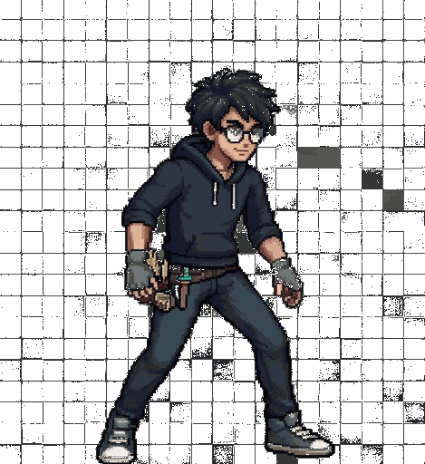

# grout

<table>
  <tr>
    <td valign="top">

grinding until the pattern shows.

mostly python practice across dsa, oop design, and real-world coding stuff.

the goal is to get faster at spotting patterns, writing clean code, and not fumbling the same bugs twice.

there's also a notes system for tracking what I did, what I messed up, and what needs review again later.

    </td>
    <td valign="top">
      
    </td>
  </tr>
</table>
